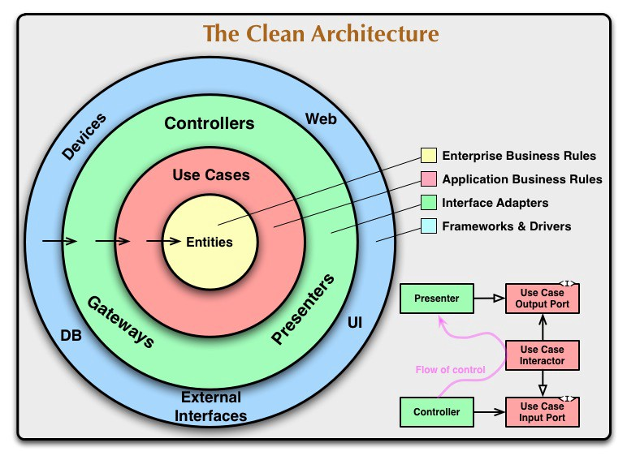

# Clean Architecture VueJS

Clean architecture with vue, shopping cart demo

[Demo](https://thanhchungbtc.github.io/vue-shopping)


## Development
```sh
yarn serve
```

## Production
```sh
yarn build
```

## Unit test
```sh
yarn test:unit
```

## Description
This is an example of implementation of Clean Architecture in Vue

It has major of 4 layers:
- Entity layer 
- Repository layer 
- Usecase layer
- Application layer - where the ui happend

 
 
 
## Tools used
- `inversify`\
Dependency injection for typescript
```ts
container
  .bind<CartRepository>("CartRepository")
  .to(CartRepositoryImpl)
  .inSingletonScope();
```
Usage
```ts
constructor(
    @inject("CartRepository") private cartRepository: CartRepository
) {}
```

- `vuetify`\
Material design ui library

- `vuex-module-decorators`\
Access `vuex` store in a type-safety way

Instead of writing as
```ts
this.$store.dispatch('cart/addProductToCart', {product: this.product, quantity: 1})
```
We write
```ts
const cartStore = getModule(CartStore, this.$store)
cartStore.addProductToCart({product: this.product, quantity: 1})
```

 

## TODO
- [x] In memory repository
- [ ] Use pouchDB to persist user's cart data
